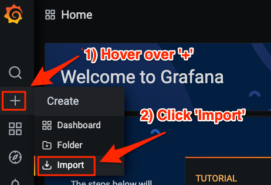

# Setting up the project

I can't say a that a ton of thought and care went into this combination of projects,
but this is only to demo Quarkus functionality.
Oh, and it works :-)

:toc: left

## Minikube

### Download and install
https://kubernetes.io/docs/tasks/tools/install-minikube/[Download and install minikube].
This session used minikube 1.12.3, although newer versions may work also.

### Configure
.Configuring Minikube
[source,shell script]
----
# Set memory based on your system's availability. 4GB may work. 6GB will work.
minikube config set memory 8092

# Set CPUs based on your system's availability.
minikube config set cpus 5

# Set driver based on your operating system. MacOS shown
minikube config set driver hyperkit
----

.Use ingress minikube addon
[source,shell script]
----
minikube addons enable ingress
----

.Start minikube
[source,shell script]
----
minikube start
----

##  Install postgres
kubectl apply -f yaml/postgres/postgresql_kubernetes.yml

## Knative

.Run script to install minikube
[source, shell shell script]
----
cd yaml/knative
chmod 755 setup_knative.sh
./setup_knative.sh

# Wait for all pods to start
kubectl get pod -A
----

## Install Prometheus and Grafana

### Install Promeetheus and Grafana

.Install prometheus and grafana using operator
[source,shell script]
----
git clone git@github.com:prometheus-operator/kube-prometheus.git

# Used with v0.6.0
git checkout tags/v0.6.0

kubectl create -f manifests/setup
until kubectl get servicemonitors --all-namespaces ; do date; sleep 1; echo ""; done
kubectl create -f manifests/

# Wait for all the pods to start
kubectl get pods -n monitoring -w

# Create a service monitor to discover the j4k application and monitor it
kubectl apply -f yaml/prometheus/j4k-servicemonitor.yaml

# Separate terminal - Port-forward grafana to see Quarkus dashboard at localhost:3000
kubectl port-forward -n monitoring service/grafana 3000:3000

# Optional step. Separate terminal
kubectl port-forward -n monitoring service/prometheus-k8s 9090:9090 # To troubleshoot if required
----

### Install Grafana dashboard

After port-forwarding the grafana service, point the browser to http://localhost:3000.
Login as user _admin_ with a password of _admin_. Create new password when prompted.

1. On Grafana home screen, click '+'
2. Click import.
+
.Import dashboard

[start=3]
3. Upload prometheus/quarkus-grafana-dashboard.json.
This was created with http://quarkusdemos.net.

## Install Jaeger

.Install Jaeger
[source,shell script]
----
cd yaml/jaeger
chmod 755 setup_jaeger.sh
./jaeger.sh create

#  Make sure operator  is  up and running
kubectl get pods -n observability  -w

# Make sure "simplest" jaeger instance is up and running
kubectl get pods  -w

# Port forward jaeger instance to view at localhost:16686
kubectl port-forward -n observability service/simplest-query 16686:16686
----
